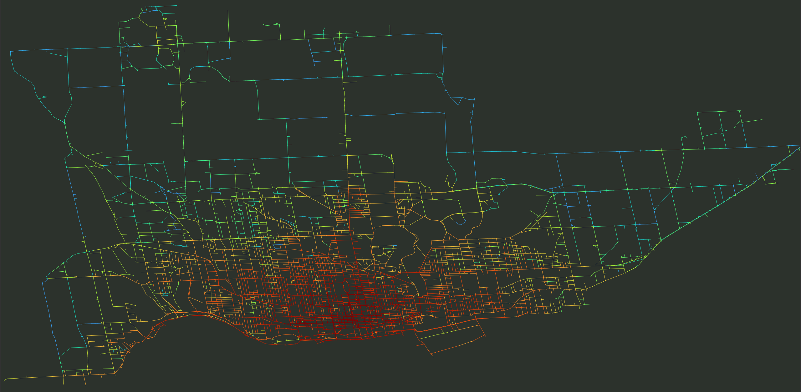

# Toronto Bike Share Analysis

**[Read the results on StoryMaps](https://storymaps.com/stories/977d7a48e8104952b3843b25ddda4ec3)**

## Overview
The objectives of this project were to determine what Toronto Bike Share data revealed about three specific bike lanes in Toronto, Canada that are targeted for removal and to practice geospatial analysis.

With the stated goal of reducing congestion, Bill 212 is a bill passed by the Province of Ontario that will remove bike lanes from three Toronto streets despite evidence that such infrastructure reduces traffic. Among other things, it will also make it more difficult for cities to install new bike infrastructure.

This analysis asks what data from the **Toronto Bike Share**, a station-based bike sharing program started in 2015, can tell us about the impact of removing the three lanes.

Statistical analysis
- General growth of Bike Share ridership
- How ridership changes seasonally
- Usage of Bike Share during rush hours

Geospatial analysis
- Bike share capacity near affected lanes

Heatmap
- Where trips likely passed through

## Key Takeaways
- In 2024, the bike share had an average of 19,500 trips per day
- Ridership has doubled since just 2021
- Ridership is roughly halved in the winter months and peaks in August
- 28% of all trips occurred during "rush hour" (7-9AM, 4-6PM), or 4,300 trips each day
- 25% of bike share stations are within a 5 minute walk of the affected bike lanes
- **58% of trips (9,000 per day) started or ended within a 5 minute walk of the affected bike lanes**
- **14% of trips (3,000 per day) started or ended near the affected lanes during rush hour**

## Process
### Statistical Analysis in Python
The ridership data for the Toronto Bike Share was pulled into a PostgreSQL database (format chosen so that PostGIS could be used in geospatial stage of analysis). Statistical analysis was performed in `bike-analysis-notebook.ipynb`, a Jupyter notebook with a connection to the database. 

Pandas and plotly were used to answer and display statistical questions, including about the growth of the system in general, the usage during rush hour, the usage during the winter, etc.

### Geospatial Analysis in QGIS
In QGIS, data was queried from OpenStreetMap and cleaned to get create a model roadway network for Toronto. The OSM data was used to identify locations and classifications of bike lanes to create a bicycle lane network map. Filtering the layer for Bloor, Yonge, and University was done to create a new layer of only Bill-212 affected lanes.

Station data for the Toronto Bike Share was pulled from the database and used to create maps showing the locations and relative capacities of stations in the city. 

To represent a 5 minute walk from the affected lanes, a 400 meter vector buffer was created from the Bill-212 affected lanes. The intersection between this buffer and the stations was used to make a list of affected stations, and represent these on a map.

The affected stations were then also used to determine what proportion of all trips started or ended at a station within a 5 minute walk of the affected bike lanes. (And what proportion of those were during rush hours).
  

### Heatmap Creation with PyQt
To create the heatmap of trips on the Toronto Bike Share, a python script was written to estimate the path taken on the roadway network based on the start and end station. The algorithm did not weigh roads with bike lanes higher than others, although a future analysis should explore this. 

The script uses the QGIS native `native:shortestpathpointtopoint` method to calculate the path based on the OSM roadway network. A future analysis should explore other, potentially more optimized approaches. 

Given the high volume of trips and access to only one mid-range PC, the script took significant time to process the trips, going through 200,000 in approximately 48 hours. In this project the network was prepared such that all bike share stations were connected, however if some of the stations in the further suburbs were to be disregarded, a smaller roadway network could be used - improving performance significantly. 

To overcome the large processing time, only trips during rush hour in August 2024 were used.

The prototype of the script calculated, stored and displayed every single calculated path in a new layer. This was not scalable. A much faster and more memory efficient approach was adopted that increments a counter in the segments in the existing road network layer each time a calculated path uses that segment.

The script also modifies a field in the trips layer that records whether or not a trip has been calculated before. This allowed the trips to be handled in chunks instead of one large continuous run.

The result is, in my opinion, quite interesting. I think it provides a unique perspective on what the actual activity of the Bike Share system as a whole looks like, how the affected bike lanes are a structural pillar of that activity, and how some of the affected bike lanes have no real alternatives.

## Close
If you are interested, please consider reading the full write up I did about this project in Story Maps. If you are interested in chatting about this analysis please feel free to reach out. 
Bluesky: [Climacity](https://bsky.app/profile/climacity.bsky.social)
Reddit: [u/climacity](https://www.reddit.com/user/Climacity/)

## Attribution
I am not affiliated with Toronto Bike Share, the City of Toronto, or the Government of Ontario.

**Tools Used**
- QGIS
- PyQt5
- PostGIS & PostSQL
- StoryMaps

**Data Used**
- Toronto Open Data - Bike Share ridership dataset
- Toronto Open Data - Bike Share stations dataset
- OpenStreetMap - Highway key for roadway network